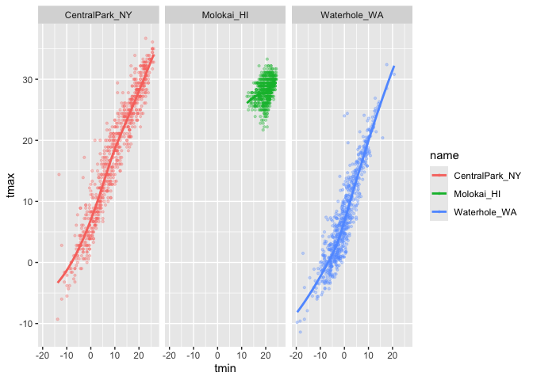
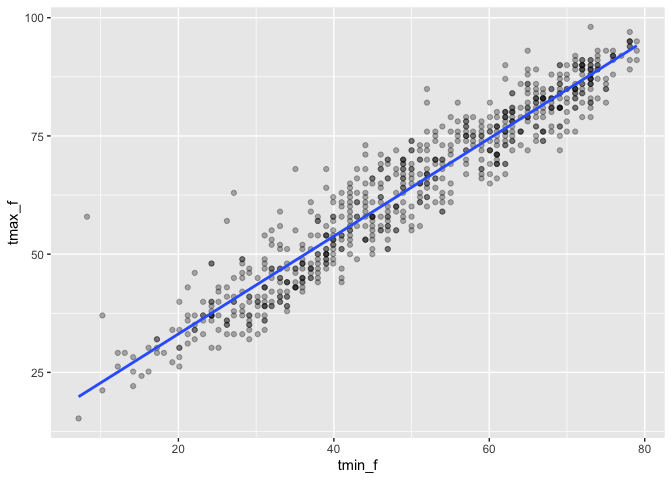
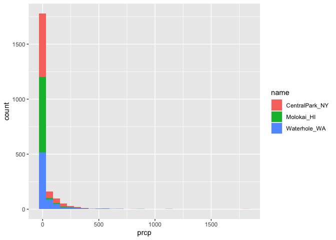
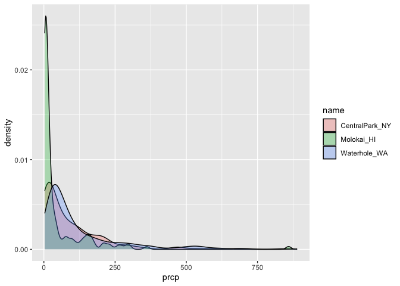

vis_1
================
My An Huynh
2024-09-26

Import weather data

``` r
weather_df = 
  rnoaa::meteo_pull_monitors(
    c("USW00094728", "USW00022534", "USS0023B17S"),
    var = c("PRCP", "TMIN", "TMAX"), 
    date_min = "2021-01-01",
    date_max = "2022-12-31") |>
  mutate(
    name = case_match(
      id, 
      "USW00094728" ~ "CentralPark_NY", 
      "USW00022534" ~ "Molokai_HI",
      "USS0023B17S" ~ "Waterhole_WA"),
    tmin = tmin / 10,
    tmax = tmax / 10) |>
  select(name, id, everything())
```

    ## using cached file: /Users/claudiahuynh/Library/Caches/org.R-project.R/R/rnoaa/noaa_ghcnd/USW00094728.dly

    ## date created (size, mb): 2024-09-26 14:18:13.607687 (8.651)

    ## file min/max dates: 1869-01-01 / 2024-09-30

    ## using cached file: /Users/claudiahuynh/Library/Caches/org.R-project.R/R/rnoaa/noaa_ghcnd/USW00022534.dly

    ## date created (size, mb): 2024-09-26 14:18:27.918547 (3.932)

    ## file min/max dates: 1949-10-01 / 2024-09-30

    ## using cached file: /Users/claudiahuynh/Library/Caches/org.R-project.R/R/rnoaa/noaa_ghcnd/USS0023B17S.dly

    ## date created (size, mb): 2024-09-26 14:18:32.85143 (1.036)

    ## file min/max dates: 1999-09-01 / 2024-09-30

Making the first plot

``` r
ggplot(weather_df, aes(x = tmin, y = tmax))+
  geom_point()
```

    ## Warning: Removed 17 rows containing missing values or values outside the scale range
    ## (`geom_point()`).

<!-- -->

``` r
weather_df |> 
ggplot(aes(x = tmin, y = tmax))+
  geom_point()
```

    ## Warning: Removed 17 rows containing missing values or values outside the scale range
    ## (`geom_point()`).

<!-- -->

``` r
ggp_weather_scatterplot = 
  weather_df |> 
  ggplot(aes(x = tmin, y = tmax))+
  geom_point()

ggp_weather_scatterplot
```

    ## Warning: Removed 17 rows containing missing values or values outside the scale range
    ## (`geom_point()`).

<!-- -->

\#Make fancier plots

geom_smooth gives a smooth line. (se = false) to hide standard error.

``` r
weather_df |> 
  ggplot(aes(x = tmin, y = tmax, color = name)) +
  geom_point(alpha = .3, size = .8) +
  geom_smooth(se = FALSE)
```

    ## `geom_smooth()` using method = 'loess' and formula = 'y ~ x'

    ## Warning: Removed 17 rows containing non-finite outside the scale range
    ## (`stat_smooth()`).

    ## Warning: Removed 17 rows containing missing values or values outside the scale range
    ## (`geom_point()`).

<!-- --> WHere you
place color = matters. See how color placed in geom_point is different.
There’s only one fitted smooth line instead of three. This is because
placing color = name in ggplot is “global”.

``` r
weather_df |> 
  ggplot(aes(x = tmin, y = tmax)) +
  geom_point(aes(color = name), alpha = .3, size = .8) +
  geom_smooth(se = FALSE)
```

    ## `geom_smooth()` using method = 'gam' and formula = 'y ~ s(x, bs = "cs")'

    ## Warning: Removed 17 rows containing non-finite outside the scale range
    ## (`stat_smooth()`).

    ## Warning: Removed 17 rows containing missing values or values outside the scale range
    ## (`geom_point()`).

<!-- -->

Faceting will separate the plots. Using facet_grid(. ~ name) will place
everything (.) in the rows. Name will go to column. The panels are
separated by name.

``` r
weather_df |> 
  ggplot(aes(x = tmin, y = tmax, color = name)) +
  geom_point(alpha = .3, size = .8) +
  geom_smooth(se = FALSE) +
  facet_grid(. ~ name)
```

    ## `geom_smooth()` using method = 'loess' and formula = 'y ~ x'

    ## Warning: Removed 17 rows containing non-finite outside the scale range
    ## (`stat_smooth()`).

    ## Warning: Removed 17 rows containing missing values or values outside the scale range
    ## (`geom_point()`).

<!-- -->

Let’s make a somewhat more interesting scatterplot. Add another
aesthetic size = so that the size of the points vary by precipitation.

``` r
weather_df |> 
  ggplot(aes(x = date, y = tmax, color = name, size = prcp))+
  geom_point(alpha = .3) +
  geom_smooth(se = FALSE) +
  facet_grid(. ~ name)
```

    ## Warning: Using `size` aesthetic for lines was deprecated in ggplot2 3.4.0.
    ## ℹ Please use `linewidth` instead.
    ## This warning is displayed once every 8 hours.
    ## Call `lifecycle::last_lifecycle_warnings()` to see where this warning was
    ## generated.

    ## `geom_smooth()` using method = 'loess' and formula = 'y ~ x'

    ## Warning: Removed 17 rows containing non-finite outside the scale range
    ## (`stat_smooth()`).

    ## Warning: The following aesthetics were dropped during statistical transformation: size.
    ## ℹ This can happen when ggplot fails to infer the correct grouping structure in
    ##   the data.
    ## ℹ Did you forget to specify a `group` aesthetic or to convert a numerical
    ##   variable into a factor?
    ## The following aesthetics were dropped during statistical transformation: size.
    ## ℹ This can happen when ggplot fails to infer the correct grouping structure in
    ##   the data.
    ## ℹ Did you forget to specify a `group` aesthetic or to convert a numerical
    ##   variable into a factor?
    ## The following aesthetics were dropped during statistical transformation: size.
    ## ℹ This can happen when ggplot fails to infer the correct grouping structure in
    ##   the data.
    ## ℹ Did you forget to specify a `group` aesthetic or to convert a numerical
    ##   variable into a factor?

    ## Warning: Removed 19 rows containing missing values or values outside the scale range
    ## (`geom_point()`).

<!-- -->

``` r
weather_df |> 
  filter(name == "CentralPark_NY") |> 
  mutate(
    tmin_f = (tmin*1.8) + 32,
    tmax_f = (tmax*1.8) + 32
  ) |> 
  ggplot(aes(x = tmin_f, y = tmax_f)) +
  geom_point(alpha = .3) + 
  geom_smooth(method = "lm", se = FALSE)
```

    ## `geom_smooth()` using formula = 'y ~ x'

<!-- -->

Scatterplots are less useful are data size grows. Geom_hex can show data
density - makes it easier to look at data. placing color = “blue” inside
ggplot will make it turn red because gg plot doesn’t have a variable
called blue.

``` r
weather_df |> 
  ggplot(aes(x = tmin, y = tmax)) + 
  geom_point(color = "blue")
```

    ## Warning: Removed 17 rows containing missing values or values outside the scale range
    ## (`geom_point()`).

<!-- -->

\##Univariate plots

``` r
weather_df |> 
  ggplot(aes(x = tmin, fill = name)) +
  geom_histogram(position = "dodge")
```

    ## `stat_bin()` using `bins = 30`. Pick better value with `binwidth`.

    ## Warning: Removed 17 rows containing non-finite outside the scale range
    ## (`stat_bin()`).

<!-- -->

How do we fix this?

``` r
weather_df |> 
  ggplot(aes(x = tmin, fill = name)) +
  geom_histogram(position = "dodge") + 
  facet_grid(. ~ name)
```

    ## `stat_bin()` using `bins = 30`. Pick better value with `binwidth`.

    ## Warning: Removed 17 rows containing non-finite outside the scale range
    ## (`stat_bin()`).

<!-- -->

Make a density plot. Density plot is a smooth version of histogram.

``` r
weather_df |> 
  ggplot(aes(x = tmin, fill = name)) + 
  geom_density(alpha = .3)
```

    ## Warning: Removed 17 rows containing non-finite outside the scale range
    ## (`stat_density()`).

<!-- -->

Make a boxplot.

``` r
weather_df |> 
ggplot(aes(x = name, y = tmin, fill = name)) + 
  geom_boxplot()
```

    ## Warning: Removed 17 rows containing non-finite outside the scale range
    ## (`stat_boxplot()`).

<!-- -->

Make a violin plot. A little better than boxplots because it gives more
insight into the distribution of data we’re looking at.

``` r
weather_df |> 
  ggplot(aes(x = name, y = tmin, fill = name)) + 
  geom_violin()
```

    ## Warning: Removed 17 rows containing non-finite outside the scale range
    ## (`stat_ydensity()`).

<!-- -->

Make a ridge plot

``` r
weather_df |> 
  ggplot(aes(x = tmin, y = name)) + 
  geom_density_ridges()
```

    ## Picking joint bandwidth of 1.41

    ## Warning: Removed 17 rows containing non-finite outside the scale range
    ## (`stat_density_ridges()`).

<!-- -->

Learning assessment

Histogram

``` r
weather_df |> 
  ggplot(aes(x = prcp, fill = name)) + 
  geom_histogram()
```

    ## `stat_bin()` using `bins = 30`. Pick better value with `binwidth`.

    ## Warning: Removed 15 rows containing non-finite outside the scale range
    ## (`stat_bin()`).

<!-- -->

Density plot

``` r
weather_df |> 
  ggplot(aes(x = prcp, fill = name)) +
  geom_density()
```

    ## Warning: Removed 15 rows containing non-finite outside the scale range
    ## (`stat_density()`).

<!-- -->

Violin

``` r
weather_df |> 
  ggplot(aes(x = name, y = prcp, fill = name)) + 
  geom_violin()
```

    ## Warning: Removed 15 rows containing non-finite outside the scale range
    ## (`stat_ydensity()`).

<!-- -->

Ridge plot

``` r
weather_df |> 
  ggplot(aes(x = prcp, y = name)) + 
  geom_density_ridges()
```

    ## Picking joint bandwidth of 9.22

    ## Warning: Removed 15 rows containing non-finite outside the scale range
    ## (`stat_density_ridges()`).

<!-- -->

``` r
weather_df |> 
  filter(prcp > 0, prcp < 1000) |> 
  ggplot(aes(x = prcp, fill = name)) +
  geom_density(alpha = .3)
```

<!-- -->

\##Saving and embedding plots

``` r
ggp_weather = 
weather_df |> 
  ggplot(aes(x = date, y = tmax, color = name))+
  geom_point()

ggsave("ggp_weather.pdf", ggp_weather, width = 8, height = 6)
```

    ## Warning: Removed 17 rows containing missing values or values outside the scale range
    ## (`geom_point()`).
