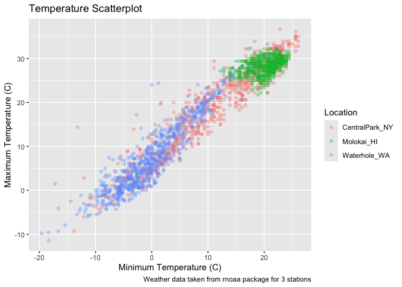
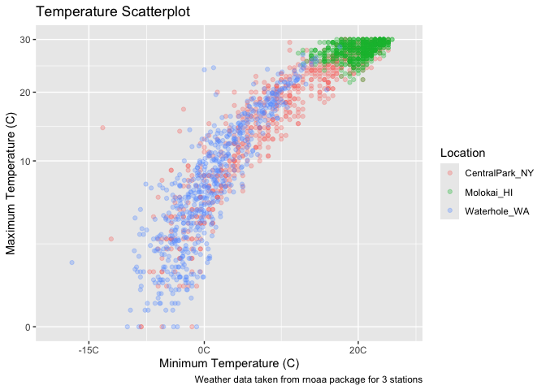
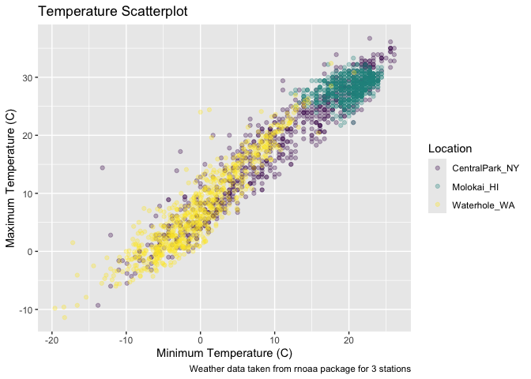
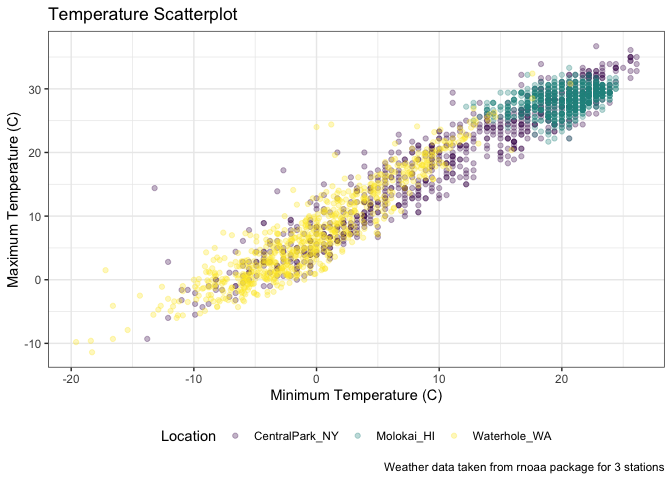
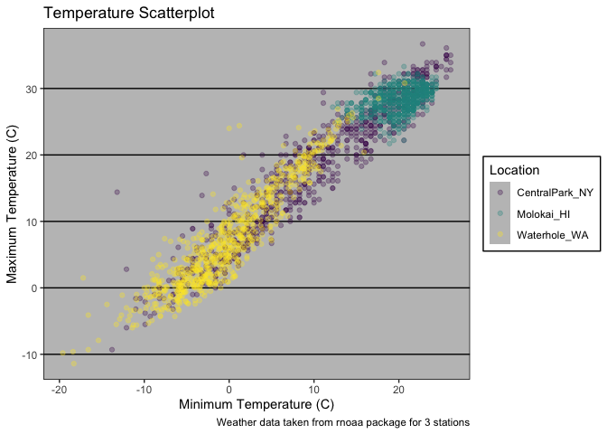

vis_2
================
My An Huynh
2024-10-01

Import weather data

``` r
weather_df = 
  rnoaa::meteo_pull_monitors(
    c("USW00094728", "USW00022534", "USS0023B17S"),
    var = c("PRCP", "TMIN", "TMAX"), 
    date_min = "2021-01-01",
    date_max = "2022-12-31") |>
  mutate(
    name = case_match(
      id, 
      "USW00094728" ~ "CentralPark_NY", 
      "USW00022534" ~ "Molokai_HI",
      "USS0023B17S" ~ "Waterhole_WA"),
    tmin = tmin / 10,
    tmax = tmax / 10) |>
  select(name, id, everything())
```

    ## using cached file: /Users/claudiahuynh/Library/Caches/org.R-project.R/R/rnoaa/noaa_ghcnd/USW00094728.dly

    ## date created (size, mb): 2024-09-26 14:18:13.607687 (8.651)

    ## file min/max dates: 1869-01-01 / 2024-09-30

    ## using cached file: /Users/claudiahuynh/Library/Caches/org.R-project.R/R/rnoaa/noaa_ghcnd/USW00022534.dly

    ## date created (size, mb): 2024-09-26 14:18:27.918547 (3.932)

    ## file min/max dates: 1949-10-01 / 2024-09-30

    ## using cached file: /Users/claudiahuynh/Library/Caches/org.R-project.R/R/rnoaa/noaa_ghcnd/USS0023B17S.dly

    ## date created (size, mb): 2024-09-26 14:18:32.85143 (1.036)

    ## file min/max dates: 1999-09-01 / 2024-09-30

Making the first plot

``` r
weather_df |> 
  ggplot(aes(x = tmin, y = tmax, color = name)) +
  geom_point(alpha = .3) +
  labs(
    title = "Temperature Scatterplot",
    x = "Minimum Temperature (C)",
    y = "Maximum Temperature (C)",
    color = "Location",
    caption = "Weather data taken from rnoaa package for 3 stations"
  )
```

    ## Warning: Removed 17 rows containing missing values or values outside the scale range
    ## (`geom_point()`).

<!-- -->

Scales – start with x and y and then do color.

``` r
weather_df |> 
  ggplot(aes(x = tmin, y = tmax, color = name)) +
  geom_point(alpha = .3) +
  labs(
    title = "Temperature Scatterplot",
    x = "Minimum Temperature (C)",
    y = "Maximum Temperature (C)",
    color = "Location",
    caption = "Weather data taken from rnoaa package for 3 stations"
  ) + 
  scale_x_continuous(
    breaks = c(-15, 0, 20),
    labels = c("-15C", "0C", "20C")
) +
  scale_y_continuous(
    limits = c(0,30), 
    transform = "sqrt"
  )
```

    ## Warning in transformation$transform(x): NaNs produced

    ## Warning in scale_y_continuous(limits = c(0, 30), transform = "sqrt"): sqrt
    ## transformation introduced infinite values.

    ## Warning: Removed 302 rows containing missing values or values outside the scale range
    ## (`geom_point()`).

<!-- -->

Look at color. Use the viridis package for built in color palette.

``` r
weather_df |> 
  ggplot(aes(x = tmin, y = tmax, color = name)) +
  geom_point(alpha = .3) +
  labs(
    title = "Temperature Scatterplot",
    x = "Minimum Temperature (C)",
    y = "Maximum Temperature (C)",
    color = "Location",
    caption = "Weather data taken from rnoaa package for 3 stations"
  ) + 
  scale_color_hue(h = c(10,400)) +
  viridis::scale_color_viridis(discrete = TRUE)
```

    ## Scale for colour is already present.
    ## Adding another scale for colour, which will replace the existing scale.

    ## Warning: Removed 17 rows containing missing values or values outside the scale range
    ## (`geom_point()`).

<!-- -->

## Themes

``` r
ggp_scatterplot =
weather_df |> 
  ggplot(aes(x = tmin, y = tmax, color = name)) +
  geom_point(alpha = .3) +
  labs(
    title = "Temperature Scatterplot",
    x = "Minimum Temperature (C)",
    y = "Maximum Temperature (C)",
    color = "Location",
    caption = "Weather data taken from rnoaa package for 3 stations"
  ) + 
  scale_color_hue(h = c(10,400)) +
  viridis::scale_color_viridis(discrete = TRUE)
```

    ## Scale for colour is already present.
    ## Adding another scale for colour, which will replace the existing scale.

``` r
ggp_scatterplot +
  theme(legend.position = "bottom")
```

    ## Warning: Removed 17 rows containing missing values or values outside the scale range
    ## (`geom_point()`).

<!-- -->

Order matters. If you put theme bw after changing the legend, the graph
will reset and the legend will be on the side.

``` r
ggp_scatterplot +
  theme_bw() +
  theme(legend.position = "bottom")
```

    ## Warning: Removed 17 rows containing missing values or values outside the scale range
    ## (`geom_point()`).

<!-- -->

ggthemes has multiple built in theme options.

``` r
ggp_scatterplot + 
  theme(legend.position = "bottom") +
  ggthemes::theme_excel()
```

    ## Warning: Removed 17 rows containing missing values or values outside the scale range
    ## (`geom_point()`).

<!-- -->

Learning assessment

``` r
  weather_df |> 
  ggplot(aes(x = date, y = tmax, color = name)) +
  geom_point(alpha = .3) +
  geom_smooth(se = FALSE)+
labs(
    title = "Temperature across time",
    x = "Date",
    y = "Maximum temperature (C)",
    color = "Location",
    caption = "Maximum temperature by date at three locations"
  ) +
    viridis::scale_color_viridis(discrete = TRUE) + 
  theme_minimal() + 
  theme(legend.position = "bottom")
```

    ## `geom_smooth()` using method = 'loess' and formula = 'y ~ x'

    ## Warning: Removed 17 rows containing non-finite outside the scale range
    ## (`stat_smooth()`).

    ## Warning: Removed 17 rows containing missing values or values outside the scale range
    ## (`geom_point()`).

<!-- -->

Extra bonus stuff in ggplot

Use different datasets in different `geoms`

``` r
central_park_df = 
  weather_df |> 
  filter(name == "Cenral_Park_NY")

molokai_df = 
  weather_df |> 
  filter(name == "Molokai_HI")
```
